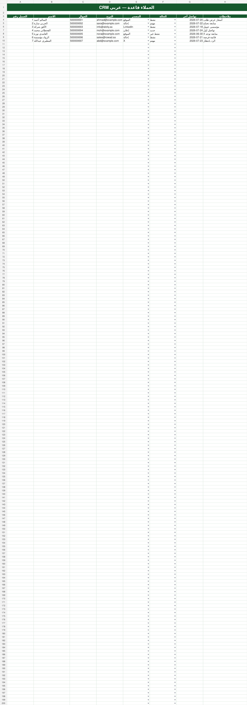

# إدارة علاقاتي

قالب CRM عربي جاهز على Excel لإدارة العملاء والفرص وسجل التواصل، ومصمم ليكون نقطة بداية عملية للمشاريع الصغيرة والفرق الخدمية.

## ما الذي يحتويه القالب؟

- **لوحة التحكم:** مؤشرات سريعة للعملاء والفرص وقيم الصفقات.
- **العملاء:** قاعدة بيانات منظمة للعملاء مع حالة العميل ومصدره.
- **الفرص:** متابعة مراحل البيع وقيمة كل فرصة وتاريخ المتابعة.
- **سجل التواصل:** توثيق المكالمات والاجتماعات والرسائل.
- **الإعدادات:** قوائم جاهزة للحالات والمصادر ومراحل الفرص.
- **دليل الاستخدام:** خطوات مختصرة للبدء والتخصيص.

## البدء

1. حمّل ملف `arabic-excel-crm.xlsx` وافتحه في Microsoft Excel أو Google Sheets.
2. استبدل الصفوف التجريبية ببياناتك الفعلية.
3. لا تغيّر عناوين الأعمدة أو خلايا الصيغ في لوحة التحكم.
4. عدّل القوائم من ورقة **الإعدادات** بما يتناسب مع سير عملك.

## ملاحظات مهمة

- البيانات الموجودة في الملف تجريبية فقط.
- احتفظ بنسخة خاصة من ملفك التشغيلي ولا تنشر بيانات العملاء على GitHub.
- القالب مرخّص برخصة MIT؛ يمكنك تعديله واستخدامه في مشاريعك.

## لقطات

| لوحة التحكم | العملاء |
| --- | --- |
|  |  |

